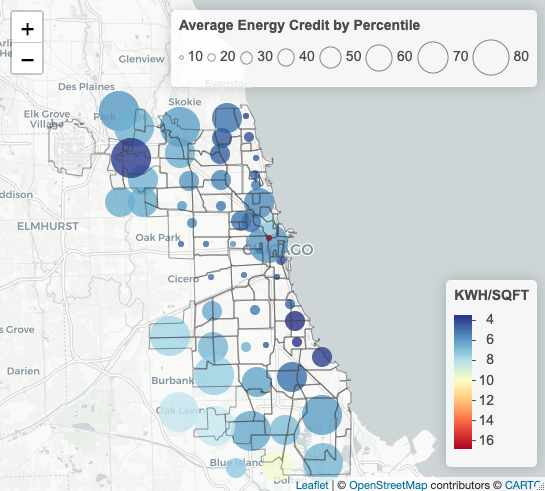

```{r, message=FALSE, echo=FALSE, warning=FALSE}
library(ggplot2)
library(dplyr)
library(readxl)
library(knitr)
```

```{r, message=FALSE, echo=FALSE, warning=FALSE}
chicago_all = read.csv("./working_data/chicago_all.csv")
```

# Abstract


# Introduction

***Motivation and Goals***

Residential energy usage prediction is a complex and highly studied challenge.  We do not seek to outperform current methods, rather to present and evaluate a novel method of predicting residential (household) energy usage: using self reported characteristics from the taxpayers within!  As energy abatement and efficiency becomes increasingly critical due to climate change, we seek to present taxpayer data as a (potentially) relevant tool policymakers can use for determining residential energy policy.  Thus, our goals are:

 * *Effectively* model residential energy usage using IRS data.
 * Analyze effectiveness of IRS data within our model, and to determine what overall taxpayer qualities **In particular Residential Energy Credits** correspond with real energy usage and reduction.

***Backround***

Every April 15, millions of Americans submit their US Individual Income Tax Return Form 1040 [Reference Docs > Fig A] to the Internal Revenue Service (IRS). This is an important administrative and even cultural event within the country, and is also a significant source of demographic and personal finance information. A significant portion of taxpayers further include Form 5695, 'Residential Energy Credits' [Reference Docs > Fig B]. These tax credits were added to the Internal Revenue Code in 2005 by the Energy Policy Act of 2005 with the goal of rewarding taxpayers for their efforts towards energy efficiency. Therefore a secondary goal of our project is to *contextualize the role of household energy credits* in residential energy prediction using IRS data and by doing so create some framework for further study on the real effect of energy tax credits on abatement.

# Methods
Our dataset is 

# Results

# Conclusion


# Appendix


## Figures


```{r, echo=FALSE, out.width='80%'}
#knitr::include_graphics("./figures/Vis01.png")
```

Fig1 [Above]: *Average residential energy tax credits claimed where plotted circle radius corresponds to average adjusted gross income (AGI)*

```{r, echo=FALSE, out.width='80%'}

```

Fig2 [Above]: *Average residential energy tax credits claimed where plotted circle radius corresponds to Therms/SQFT*

```{r, echo=FALSE, out.width='80%'}
knitr::include_graphics("./figures/Vis03.png")
```

Fig3 [Above]: *Average residential energy tax credits claimed where plotted circle radius corresponds to KWH/SQFT*

```{r, echo=FALSE, message=FALSE, eval=FALSE, out.width="65%", fig.asp = 1.3, fig.align='center'}
#GGPLOT of energy by zip code

#Visualize data
# Scatterplot for both KWH.PER.SQFT and THERMS.PER.SQFT
# Convert zip code to a factor variable
# vis00 = chicago_all %>% 
#   mutate(zip = stringr::str_to_title(zip))
# 
# ggplot(vis00, aes(x = zip, y = KWH.PER.SQFT, color = "KWH.PER.SQFT")) +
#   geom_point(size = 1.5) +
#   geom_point(aes(y = THERMS.PER.SQFT, color = "THERMS.PER.SQFT"), size = 1.5) + 
#   scale_y_log10() + 
#   labs(y = "Log10(Energy)", x = "ZipCode", color = "Energy Type") + 
#   scale_color_manual(values = c("KWH.PER.SQFT" = "yellow", "THERMS.PER.SQFT" = "orange")) +
#   ggtitle("Energy Usage by Zip Codes") +
#   coord_flip() +
#   theme_minimal() +
#   theme(
#     axis.text = element_text(size = 10),  # Decrease the font size of axis labels
#     legend.position = "bottom",  # Position the legend on the bottom
#     legend.text = element_text(size = 10),  # Decrease the font size of legend text
#     plot.title = element_text(hjust = 0.5)  # Center the plot title
#   )  
```


## Reference Tables

[Table A] *IRS Codebook*
```{r, message=FALSE, echo=FALSE, warning=FALSE, out.width="65%"}
#IRSdatavarnames
IRSvarnames = read_excel("./artifacts/Codebook.xlsx","SelectedVars") %>% select(Variable, Description) %>% filter(Variable %in% colnames(chicago_all))
IRSvarnames %>%
  knitr::kable()
```


## Reference Docs

[Fig A] Below: *IRS Form 1040*

```{r, echo=FALSE}
knitr::include_graphics("./figures/IRSform1040.jpeg")
```


[Fig B] Below: *IRS Form 5695: Residential Energy Tax Credit*

```{r, echo=FALSE}
knitr::include_graphics("./figures/IRSform5695.jpeg")
```


