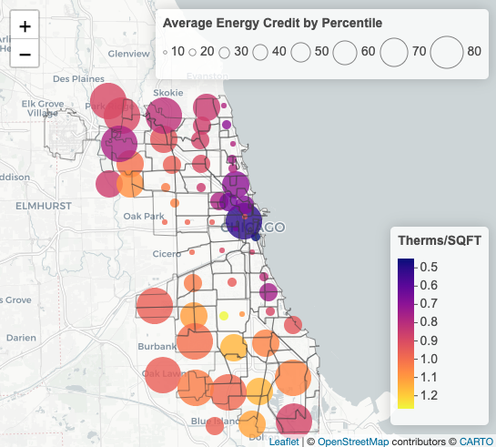

```{r, message=FALSE, echo=FALSE, warning=FALSE}
library(ggplot2)
library(dplyr)
library(readxl)
library(knitr)
```

```{r, message=FALSE, echo=FALSE, warning=FALSE}
chicago_all = read.csv("./working_data/chicago_all.csv")
```

# Abstract


# Introduction

***Motivation and Goals***

Residential energy usage prediction is a complex and highly studied challenge.  We do not seek to outperform current methods, rather to present and evaluate a novel method of predicting residential (household) energy usage: using self reported characteristics from the taxpayers within!  As energy abatement and efficiency becomes increasingly critical due to climate change, we seek to present taxpayer data as a (potentially) relevant tool policymakers can use for determining residential energy policy.  Thus, our goals are:

 * *Effectively* model residential energy usage using IRS data.
 * Analyze effectiveness of IRS data within our model, and to determine what overall taxpayer qualities **In particular Residential Energy Credits** correspond with real energy usage and reduction.

***Background***

Every April 15, millions of Americans submit their US Individual Income Tax Return Form 1040 [Reference Docs > Fig A] to the Internal Revenue Service (IRS). This is an important administrative and even cultural event within the country, and is also a significant source of demographic and personal finance information. A significant portion of taxpayers further include Form 5695, 'Residential Energy Credits' [Reference Docs > Fig B]. These tax credits were added to the Internal Revenue Code in 2005 by the Energy Policy Act of 2005 with the goal of rewarding taxpayers for their efforts towards energy efficiency. Therefore a secondary goal of our project is to *contextualize the role of household energy credits* in residential energy prediction using IRS data and by doing so create some framework for further study on the real effect of energy tax credits on abatement.

# Methods

***Data***

Our master data file is contained within our repo in './working_data/chicago_all.csv'.

```{r, echo=FALSE, out.width='80%'}
#head(chicago_all)
```

Our energy usage data which comprises the first 23 variables of chicago_all is from "https://data.cityofchicago.org/Environment-Sustainable-Development/Energy-Usage-2010/8yq3-m6wp/about_data".  That data is here: './working_data/prework/final_updated_energy_usage_with_coordinates.csv', where we have added a `zip` variable along with  `Latitude` and `Longitude` variables using python using the 'uszipcode' library in python. This novel and detailed data set contains energy usage information from primary providers on commercial and residential housing totals by housing subtype = single_family, <7, and 7+ (multifamily). According to the source, the electricity data (KWH) comprises 68 percent of overall electrical usage in the city while gas data comprises 81 percent of all gas consumption (Therms).  

Our IRS 1040 data, beginning with the `STATE` variable, is from "https://www.irs.gov/statistics/soi-tax-stats-individual-income-tax-statistics-zip-code-data-soi".  We downloaded the zip data file from 2009.  That data is here: './working_data/prework/09zpallagi_stdz.csv' with minor cleaning performed in python.  This data set contains line item totals, by zip code and AGI_STUB (class of 1:6 based on Adjusted Gross Income (AGI) levels) as well as line items with zip code return totals and amount totals (in the thousands of dollars, when relevant) for a number of line items from IRS Form 1040 and attached forms. The dataset contains data from both IRS 1040 and 1040 EZ returns, when applicable. For documentation information for TY2009 see './artifacts/documentation/09zpdoc'.

To recreate our master data file, please pull our github repository and run './code/data_wrangling.Rmd'. After aggregating each dataset by zip code, we create our target variables `THERMS.PER.SQFT` and `KWH.PER.SQFT`.  Therms are a measure of natural gas where 1 Therm is equal to 100sqft of natural gas.  It is a rather large unit.  Kilowatts per squarfeet is a standard measure of electricity and is smaller, relatively.  We standardize each of these using the Chicago dataset's `THERMS.TOTAL.SQFT` and `KWH.TOTAL.SQFT`, which is the square footage associated with the electric and gas energy usage, respectively, in 2010 according to Cook County Assessor Records.  We believe this is an accurate measure of how much energy residents of a zip code are using, on average.  We further performing averages on the IRS data by weighing each count and amount variables 

***Approach***

Our training and modeling code is all contained in './code/model_prediction.Rmd'.  First we subset chicago_all into a data frame which only contains variables from within the Chicago energy dataset.  We'll use this as a benchmark to determine whether the IRS variables are adding any predictive power.  Then we divide into training and testing data sets and run a slate of machine learning algorithms (Random Forest, Gradient Boosted Decision Tree (GBDT), and XGBoost) along with a baseline linear model.  We then use GBM summary function and XGBoost 'Gain' metrics to determine which variables are "important".  Here, we expect variables from the Chicago energy data set to be relevant, but are more interested in the novel information we can gain from the IRS data including residential energy credits.


# Results
```{r, echo=FALSE, out.width='80%'}
therm_result = read.csv("./figures/therm_result.csv")
kwh_result = read.csv("./figures/kwh_result.csv")
colnames(therm_result) = c("Model","therm_all_rmse","therm_only_rmse","therm_all_mpe","therm_only_mpe")
colnames(kwh_result) = c("Model","kwh_all_rmse","kwh_only_rmse","kwh_all_mpe","kwh_only_mpe")
kable(therm_result)
```
First we look at the metrics for Therms. We fitted four models: baseline linear model, random forest model, gradient boosting tree model and XGBoost tree model, to only the Chicago energy consumption data (therm_only) and including the IRS data(therm_all). We first compare between these two data sets to see, whether the IRS data have significant predictable power on the real therm consumption. We can see except the baseline model, the rmse of therm_all are pretty close to the therm_only. Except the XGBoost model, they even have lager rmse value which we think may due to overfitness. For the mpe metric, both GBDT and XGBoost perform better in the therm_all data set. But considering the much larger amount of features, we are not sure whether the IRS patterns truly make effect.

```{r, echo=FALSE, out.width='80%'}
kable(kwh_result)
```
Then we look at the KWH result. Similarly, except the baseline model, the rmse of kwh_all data set are close to the kwh_only and the mpe of GBDT and XGBoost model are weakly better for kwh_all. Considering the larger amount of fitted variables, we are not sure whether the IRS patterns truly make effect. 

Overall the XGBoost model gives us the best prediction for both therm data and kwh data. Now, we are going to explore how the predicted values from XGBoost connected to the true data.
//residual plot analysis 


Now we explore which part of IRS data has the most predictable power on the Chicago energy consumption. We list the top 15 most important features from XGBoost and GBDT model for therm and kwh in the refrence table B and table C.
We first focus on the features which both appear in 2 models. For therms, AVERAGE.HOUSESIZE, AVERAGE.STORIES, Latitude, Longitude - the Chicago features, and A11902_av and N01000_av - the IRS features all appear twice. For kwh, AVERAGE.STORIES, RATIO.OWNED, AVERAGE.BUILDING.AGE, AVERAGE.HOUSESZIE, Latitude, Longitude - the Chichago features, and A07100_av, N00900_av, N01700_av and A01700_av - the IRS features all appear twice. 
We are interested in who are these IRS variables and explore intuitively for why thet matters. Here are the details:
A11902: Overpayments refunded amount;
N01000: Number of returns with net capital gain (less loss);
A07100: Total tax credits amount;
N00900: Number of returns with business or professional net income;
N01700: Number of returns with taxable pensions and annuities;
A01700: Taxable pensions and annuities amount;

We are also happy to see that N077260 appears in both GBDT model and A07260 appears in GDBT model for therm. It successfully prove our assumption that the energy tax credit is a good candidate for the real energy consumption.
N07260: Number of returns with residential energy tax credit;
A07260: Residential energy tax credit amount;


# Conclusion


# Appendix


## Figures


```{r, echo=FALSE, out.width='80%'}
#
```

Fig1 [Above]: *Average residential energy tax credits claimed where plotted circle radius corresponds to average adjusted gross income (AGI)*

```{r, echo=FALSE, out.width='80%'}
knitr::include_graphics("./figures/Vis02.png")
```

Fig2 [Above]: *Average residential energy tax credits claimed where plotted circle radius corresponds to Therms/SQFT*

```{r, echo=FALSE, out.width='80%'}
knitr::include_graphics("./figures/Vis03.png")
```

Fig3 [Above]: *Average residential energy tax credits claimed where plotted circle radius corresponds to KWH/SQFT*

```{r, echo=FALSE, message=FALSE, eval=FALSE, out.width="65%", fig.asp = 1.3, fig.align='center'}
#GGPLOT of energy by zip code

#Visualize data
# Scatterplot for both KWH.PER.SQFT and THERMS.PER.SQFT
# Convert zip code to a factor variable
# vis00 = chicago_all %>% 
#   mutate(zip = stringr::str_to_title(zip))
# 
# ggplot(vis00, aes(x = zip, y = KWH.PER.SQFT, color = "KWH.PER.SQFT")) +
#   geom_point(size = 1.5) +
#   geom_point(aes(y = THERMS.PER.SQFT, color = "THERMS.PER.SQFT"), size = 1.5) + 
#   scale_y_log10() + 
#   labs(y = "Log10(Energy)", x = "ZipCode", color = "Energy Type") + 
#   scale_color_manual(values = c("KWH.PER.SQFT" = "yellow", "THERMS.PER.SQFT" = "orange")) +
#   ggtitle("Energy Usage by Zip Codes") +
#   coord_flip() +
#   theme_minimal() +
#   theme(
#     axis.text = element_text(size = 10),  # Decrease the font size of axis labels
#     legend.position = "bottom",  # Position the legend on the bottom
#     legend.text = element_text(size = 10),  # Decrease the font size of legend text
#     plot.title = element_text(hjust = 0.5)  # Center the plot title
#   )  
```


## Reference Tables

[Table A] *IRS Codebook*
```{r, message=FALSE, echo=FALSE, warning=FALSE, out.width="65%"}
#IRSdatavarnames
IRSvarnames = read_excel("./artifacts/Codebook.xlsx","SelectedVars") %>% select(Variable, Description) %>% filter(Variable %in% colnames(chicago_all))
IRSvarnames %>%
  knitr::kable()
```

[Table B] *Therm Feature Importance Rank*
```{r, message=FALSE, echo=FALSE, warning=FALSE, out.width="65%"}
# Importance Rank 
therm_importance_result = read.csv("./figures/therm_importance_result.csv")
kwh_importance_result = read.csv("./figures/kwh_importance_result.csv")
kable(therm_importance_result)
```

[Table C] *KWH Feature Importance Rank*
```{r, message=FALSE, echo=FALSE, warning=FALSE, out.width="65%"}
kable(kwh_importance_result)
```

## Reference Docs

[Fig A] Below: *IRS Form 1040*

```{r, echo=FALSE}

```


[Fig B] Below: *IRS Form 5695: Residential Energy Tax Credit*

```{r, echo=FALSE}
knitr::include_graphics("./figures/IRSform5695.jpeg")
```


