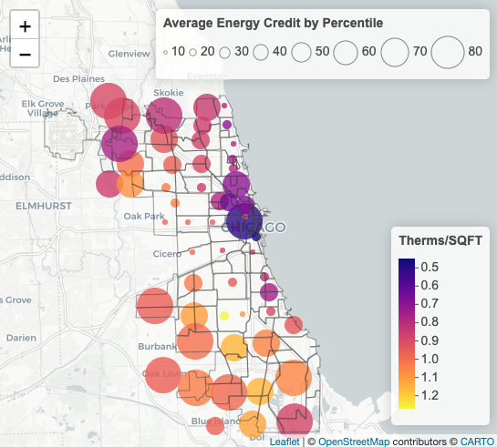

## Can we predict Chicago zip code thermal and electricity usage using tax data?  

  

- We perform a modeling exersize with useful academic/policy extensions using 2009 US Individual Income Tax Return data and 2010 City of Chicago residential energy usage data (see Final_Report.pdf).
- Our principal goal is to provide a novel avenue for prediction.  We also seek to test whether there is a clear relationship between real energy consumption and IRS Residential Energy Tax Credits
